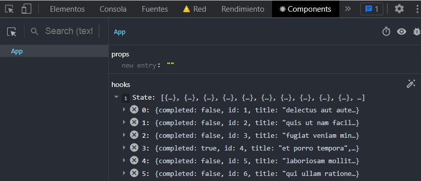

# react-05-api

```terminal
npx create-react-app react-api
```

```terminal
cd react-api
```

```terminal
npm start
```

## API  

<https://jsonplaceholder.typicode.com/todos>

Devuelve una respuesta de tipo JSON.



